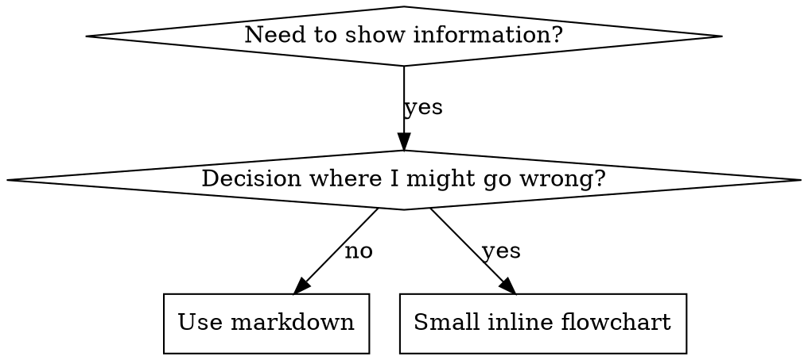

# Writing Rules

## Overview

**Writing rules (skills + always-apply rules) IS Test-Driven Development applied to process documentation.**

**Rules are maintained in `.claude/rules/` as MDC files with frontmatter. Ruler processes rules based on `alwaysApply`:**

- `alwaysApply: false` (or omitted) → generates `.claude/skills/` (context-loaded)
- `alwaysApply: true` → merged into `AGENTS.md` (always present)

**How it works:**

1. Write rule as `.mdc` file in `.claude/rules/` with frontmatter (`alwaysApply: true/false`)
2. **REQUIRED:** Run `npx skiller@latest apply` after ANY rule creation or update
3. Ruler processes based on `alwaysApply`:
   - `false` → generates `.claude/skills/` (context-loaded by Claude Code)
   - `true` → merges into `AGENTS.md` (always present)
4. Optionally add `globs` for file pattern matching

You identify common failure patterns (baseline behavior), write the skill (documentation) addressing those patterns, then verify through application scenarios, and refactor (close loopholes).

**Core principle:** If you didn't identify what agents naturally do wrong, you don't know if the skill prevents the right failures.

**REQUIRED BACKGROUND:** You MUST understand test-driven-development before using this skill. That skill defines the fundamental RED-GREEN-REFACTOR cycle. This skill adapts TDD to documentation.

**Official guidance:** For Anthropic's official skill authoring best practices, see anthropic-best-practices.md. This document provides additional patterns and guidelines that complement the TDD-focused approach in this skill.

## What is a Skill?

A **skill** is a reference guide for proven techniques, patterns, or tools. Skills help future Claude instances find and apply effective approaches.

**Skills are:** Reusable techniques, patterns, tools, reference guides

**Skills are NOT:** Narratives about how you solved a problem once

## TDD Mapping for Skills

| TDD Concept             | Skill Creation                                   |
| ----------------------- | ------------------------------------------------ |
| **Test case**           | Anticipated failure pattern from experience      |
| **Production code**     | Skill document (.mdc file in .claude/rules/)     |
| **Test fails (RED)**    | Identify common mistakes without skill           |
| **Test passes (GREEN)** | Skill addresses those specific mistakes          |
| **Refactor**            | Close loopholes while maintaining clarity        |
| **Write test first**    | Identify failure patterns BEFORE writing skill   |
| **Watch it fail**       | Document exact rationalizations from experience  |
| **Minimal code**        | Write skill addressing those specific violations |
| **Watch it pass**       | Verify skill clarity through application         |
| **Refactor cycle**      | Find new rationalizations → plug → re-verify     |

The entire skill creation process follows RED-GREEN-REFACTOR.

## When to Create a Skill

**Create when:**

- Technique wasn't intuitively obvious to you
- You'd reference this again across projects
- Pattern applies broadly (not project-specific)
- Others would benefit

**Don't create for:**

- One-off solutions
- Standard practices well-documented elsewhere
- Project-specific conventions (put in CLAUDE.md)

## Skill Types

### Technique

Concrete method with steps to follow (condition-based-waiting, root-cause-tracing)

### Pattern

Way of thinking about problems (flatten-with-flags, test-invariants)

### Reference

API docs, syntax guides, tool documentation (office docs)

## Directory Structure

**Single-file skills** (default):

```
.claude/rules/
  skill-name.mdc         # MDC file with frontmatter
```

**Multi-file skills** (only if >1 file needed):

```
.claude/rules/
  skill-name/
    skill-name.mdc       # Main skill (same basename as folder)
    supporting-file.*    # Additional files
```

**Ruler auto-generates from rules** - `npx skiller@latest apply` creates `.claude/skills/` from `.claude/rules/`

**When to use folders:**

- **Heavy reference** (100+ lines) - API docs, comprehensive syntax
- **Reusable tools** - Scripts, utilities, templates
- **Multiple files** - Anything requiring >1 file

**Single .mdc file when:**

- All content fits inline
- No external scripts or heavy reference
- Principles, concepts, code patterns (< 50 lines)

## MDC File Structure

**MDC format** (.mdc files) with **frontmatter**:

**Frontmatter fields:**

- `name`: Skill identifier (letters, numbers, hyphens only)
- `description`: Discovery text (max 1024 chars total for frontmatter)
  - Start with "Use when..." to focus on triggering conditions
  - Include specific symptoms, situations, contexts
  - Written in third person
  - Keep under 500 characters if possible
- `alwaysApply`: Must be `false` or omitted (ruler only generates skills from non-always rules)

```markdown
---
name: skill-name-with-hyphens
description: Use when [specific triggering conditions and symptoms] - [what the skill does and how it helps, written in third person]
alwaysApply: false
---

# Skill Name

## Overview

What is this? Core principle in 1-2 sentences.

## When to Use

[Small inline flowchart IF decision non-obvious]

Bullet list with SYMPTOMS and use cases
When NOT to use

## Core Pattern (for techniques/patterns)

Before/after code comparison

## Quick Reference

Table or bullets for scanning common operations

## Implementation

Inline code for simple patterns
Link to file for heavy reference or reusable tools

## Common Mistakes

What goes wrong + fixes

## Real-World Impact (optional)

Concrete results
```

## Claude Search Optimization (CSO)

**Critical for discovery:** Future Claude needs to FIND your skill

### 1. Rich Description Field

**Purpose:** Claude reads description to decide which skills to load for a given task. Make it answer: "Should I read this skill right now?"

**Format:** Start with "Use when..." to focus on triggering conditions, then explain what it does

**Content:**

- Use concrete triggers, symptoms, and situations that signal this skill applies
- Describe the _problem_ (race conditions, inconsistent behavior) not _language-specific symptoms_ (setTimeout, sleep)
- Keep triggers technology-agnostic unless the skill itself is technology-specific
- If skill is technology-specific, make that explicit in the trigger
- Write in third person (injected into system prompt)

```yaml
# ❌ BAD: Too abstract, vague, doesn't include when to use
description: For async testing

# ❌ BAD: First person
description: I can help you with async tests when they're flaky

# ❌ BAD: Mentions technology but skill isn't specific to it
description: Use when tests use setTimeout/sleep and are flaky

# ✅ GOOD: Starts with "Use when", describes problem, then what it does
description: Use when tests have race conditions, timing dependencies, or pass/fail inconsistently - replaces arbitrary timeouts with condition polling for reliable async tests

# ✅ GOOD: Technology-specific skill with explicit trigger
description: Use when using React Router and handling authentication redirects - provides patterns for protected routes and auth state management
```

### 2. Keyword Coverage

Use words Claude would search for:

- Error messages: "Hook timed out", "ENOTEMPTY", "race condition"
- Symptoms: "flaky", "hanging", "zombie", "pollution"
- Synonyms: "timeout/hang/freeze", "cleanup/teardown/afterEach"
- Tools: Actual commands, library names, file types

### 3. Descriptive Naming

**Use active voice, verb-first:**

- ✅ `creating-skills` not `skill-creation`
- ✅ `writing-rules` not `rule-writing`

### 4. Token Efficiency (Critical)

**Problem:** getting-started and frequently-referenced skills load into EVERY conversation. Every token counts.

**Target word counts:**

- getting-started workflows: <150 words each
- Frequently-loaded skills: <200 words total
- Other skills: <500 words (still be concise)

**Techniques:**

**Move details to tool help:**

```bash
# ❌ BAD: Document all flags in SKILL.md
search-conversations supports --text, --both, --after DATE, --before DATE, --limit N

# ✅ GOOD: Reference --help
search-conversations supports multiple modes and filters. Run --help for details.
```

**Use cross-references:**

```markdown
# ❌ BAD: Repeat workflow details

When implementing feature, follow these 20 steps...
[20 lines of repeated instructions from another skill]

# ✅ GOOD: Reference other skill

For implementation workflow, REQUIRED: Use [other-skill-name] for complete process.
```

**Compress examples:**

```markdown
# ❌ BAD: Verbose example (42 words)

your human partner: "How did we handle authentication errors in React Router before?"
You: I'll search for React Router authentication patterns in our codebase and documentation to find previous implementations.
[Detailed explanation of search process...]

# ✅ GOOD: Minimal example (15 words)

Partner: "How did we handle auth errors in React Router?"
You: [Search codebase → provide solution]
```

**Eliminate redundancy:**

- Don't repeat what's in cross-referenced skills
- Don't explain what's obvious from command
- Don't include multiple examples of same pattern

**Verification:**

```bash
wc -w .claude/rules/skill-name.mdc
# getting-started workflows: aim for <150 each
# Other frequently-loaded: aim for <200 total
```

**Name by what you DO or core insight:**

- ✅ `condition-based-waiting` > `async-test-helpers`
- ✅ `using-skills` not `skill-usage`
- ✅ `flatten-with-flags` > `data-structure-refactoring`
- ✅ `root-cause-tracing` > `debugging-techniques`

**Gerunds (-ing) work well for processes:**

- `creating-skills`, `testing-skills`, `debugging-with-logs`
- Active, describes the action you're taking

### 4. Cross-Referencing Other Skills

**When writing documentation that references other skills:**

Use skill name only, with explicit requirement markers:

- ✅ Good: `**REQUIRED SUB-SKILL:** Use superpowers test-driven-development`
- ✅ Good: `**REQUIRED BACKGROUND:** You MUST understand superpowers systematic-debugging`
- ❌ Bad: `See .claude/rules/test-driven-development.mdc` (unclear if required)
- ❌ Bad: `@.claude/rules/test-driven-development.mdc` (force-loads, burns context)

**Why no @ links:** `@` syntax force-loads files immediately, consuming 200k+ context before you need them.

## Flowchart Usage



**Use flowcharts ONLY for:**

- Non-obvious decision points
- Process loops where you might stop too early
- "When to use A vs B" decisions

**Never use flowcharts for:**

- Reference material → Tables, lists
- Code examples → Markdown blocks
- Linear instructions → Numbered lists
- Labels without semantic meaning (step1, helper2)

See @graphviz-conventions.dot for graphviz style rules.

## Code Examples

**One excellent example beats many mediocre ones**

Choose most relevant language:

- Testing techniques → TypeScript/JavaScript
- System debugging → Shell/Python
- Data processing → Python

**Good example:**

- Complete and runnable
- Well-commented explaining WHY
- From real scenario
- Shows pattern clearly
- Ready to adapt (not generic template)

**Don't:**

- Implement in 5+ languages
- Create fill-in-the-blank templates
- Write contrived examples

You're good at porting - one great example is enough.

## File Organization

### Self-Contained Skill (Default)

```
.claude/rules/
  defense-in-depth.mdc    # Everything inline
```

**When:** All content fits, no heavy reference needed

### Skill with Reusable Tool

```
.claude/rules/
  condition-based-waiting/
    condition-based-waiting.mdc  # Overview + patterns
    example.ts                   # Working helpers to adapt
```

**When:** Tool is reusable code, not just narrative

### Skill with Heavy Reference

```
.claude/rules/
  pptx/
    pptx.mdc       # Overview + workflows
    pptxgenjs.md   # 600 lines API reference
    ooxml.md       # 500 lines XML structure
    scripts/       # Executable tools
```

**When:** Reference material too large for inline

**Note:** Ruler copies all files from skill folder to `.claude/skills/` when `.mdc` basename matches folder name

## The Iron Law (Same as TDD)

```
NO SKILL WITHOUT IDENTIFYING FAILURE PATTERNS FIRST
```

This applies to NEW skills AND EDITS to existing skills.

Write skill before identifying what it prevents? Delete it. Start over.
Edit skill without identifying new failure patterns? Same violation.

**No exceptions:**

- Not for "simple additions"
- Not for "just adding a section"
- Not for "documentation updates"
- Don't keep unverified changes as "reference"
- Don't "adapt" while applying
- Delete means delete

**REQUIRED BACKGROUND:** The test-driven-development skill explains why this matters. Same principles apply to documentation.

## Verifying All Skill Types

Different skill types need different verification approaches:

### Discipline-Enforcing Skills (rules/requirements)

**Verify with:**

- Anticipate academic questions: Does skill explain the rules clearly?
- Anticipate pressure scenarios: Does skill address rationalizations under stress?
- Identify multiple pressures: time + sunk cost + exhaustion
- Add explicit counters for each rationalization

**Success criteria:** Skill prevents violations under anticipated pressures

### Technique Skills (how-to guides)

**Examples:** condition-based-waiting, root-cause-tracing, defensive-programming

**Verify with:**

- Application to real scenarios: Does skill guide correctly?
- Variation scenarios: Does skill cover edge cases?
- Gap analysis: Are common use cases covered?

**Success criteria:** Skill enables successful technique application

### Pattern Skills (mental models)

**Examples:** reducing-complexity, information-hiding concepts

**Verify with:**

- Recognition guidance: Does skill explain when pattern applies?
- Application examples: Does skill show how to use the mental model?
- Counter-examples: Does skill clarify when NOT to apply?

**Success criteria:** Skill enables correct pattern recognition and application

### Reference Skills (documentation/APIs)

**Examples:** API documentation, command references, library guides

**Verify with:**

- Information retrieval: Is right information findable?
- Application examples: Are use cases clear and correct?
- Gap analysis: Are common scenarios covered?

**Success criteria:** Skill enables finding and correctly applying information

## Common Rationalizations for Skipping Verification

| Excuse                          | Reality                                                                 |
| ------------------------------- | ----------------------------------------------------------------------- |
| "Skill is obviously clear"      | Clear to you ≠ clear to other agents. Verify it.                        |
| "It's just a reference"         | References can have gaps, unclear sections. Verify information access.  |
| "Verification is overkill"      | Unverified skills have issues. Always. 15 min verification saves hours. |
| "I'll verify if problems arise" | Problems = agents can't use skill. Verify BEFORE deploying.             |
| "Too tedious to verify"         | Verification is less tedious than debugging bad skill in production.    |
| "I'm confident it's good"       | Overconfidence guarantees issues. Verify anyway.                        |
| "Academic review is enough"     | Reading ≠ using. Verify through application.                            |
| "No time to verify"             | Deploying unverified skill wastes more time fixing it later.            |

**All of these mean: Verify before deploying. No exceptions.**

## Bulletproofing Skills Against Rationalization

Skills that enforce discipline (like TDD) need to resist rationalization. Agents are smart and will find loopholes when under pressure.

**Psychology note:** Understanding WHY persuasion techniques work helps you apply them systematically. See persuasion-principles.md for research foundation (Cialdini, 2021; Meincke et al., 2025) on authority, commitment, scarcity, social proof, and unity principles.

### Meta-Verification (When Application Reveals Gaps)

**After applying skill and finding it unclear, ask yourself:**

```markdown
I read the skill and still chose wrong approach.

How could that skill have been written differently to make
it crystal clear what the correct choice was?
```

**Three possible answers:**

1. **"The skill WAS clear, I chose to ignore it"**

   - Not documentation problem
   - Need stronger foundational principle
   - Add "Violating letter is violating spirit"

2. **"The skill should have said X"**

   - Documentation problem
   - Add that guidance verbatim

3. **"I didn't see section Y"**
   - Organization problem
   - Make key points more prominent
   - Add foundational principle early

### When Skill is Bulletproof

**Signs of bulletproof skill:**

1. **Correct choice is obvious** even under pressure
2. **Skill anticipates** the specific rationalizations
3. **Red flags section** catches you before violation
4. **Meta-verification reveals** "skill was clear, I should follow it"

**Not bulletproof if:**

- You find new rationalizations during application
- Skill leaves room for "hybrid approaches"
- Multiple valid interpretations exist
- Doesn't address "spirit vs letter" argument

### Example: Bulletproofing Process

**Initial Version (Failed):**

```markdown
Scenario: 200 lines done, forgot rule, exhausted, dinner plans
Applied skill: Still chose wrong approach
Rationalization: "Already achieve same goals differently"
```

**Iteration 1 - Add Counter:**

```markdown
Added section: "Why This Specific Approach Matters"
Re-applied: STILL chose wrong approach
New rationalization: "Spirit not letter"
```

**Iteration 2 - Add Foundational Principle:**

```markdown
Added: "Violating letter is violating spirit"
Re-applied: Chose correct approach
Cited: New principle directly
Meta-verification: "Skill was clear, I should follow it"
```

**Bulletproof achieved.**

### Close Every Loophole Explicitly

Don't just state the rule - forbid specific workarounds:

<Bad>
```markdown
Write code before test? Delete it.
```
</Bad>

<Good>
```markdown
Write code before test? Delete it. Start over.

**No exceptions:**

- Don't keep it as "reference"
- Don't "adapt" it while writing tests
- Don't look at it
- Delete means delete

````
</Good>

### Address "Spirit vs Letter" Arguments

Add foundational principle early:

```markdown
**Violating the letter of the rules is violating the spirit of the rules.**
````

This cuts off entire class of "I'm following the spirit" rationalizations.

### Build Rationalization Table

Capture rationalizations from baseline testing (see Testing section below). Every excuse agents make goes in the table:

```markdown
| Excuse                           | Reality                                                                 |
| -------------------------------- | ----------------------------------------------------------------------- |
| "Too simple to test"             | Simple code breaks. Test takes 30 seconds.                              |
| "I'll test after"                | Tests passing immediately prove nothing.                                |
| "Tests after achieve same goals" | Tests-after = "what does this do?" Tests-first = "what should this do?" |
```

### Create Red Flags List

Make it easy for agents to self-check when rationalizing:

```markdown
## Red Flags - STOP and Start Over

- Code before test
- "I already manually tested it"
- "Tests after achieve the same purpose"
- "It's about spirit not ritual"
- "This is different because..."

**All of these mean: Delete code. Start over with TDD.**
```

### Update CSO for Violation Symptoms

Add to description: symptoms of when you're ABOUT to violate the rule:

```yaml
description: use when implementing any feature or bugfix, before writing implementation code
```

## RED-GREEN-REFACTOR for Skills

Follow the TDD cycle:

### RED: Identify Failure Patterns (Baseline)

Before writing skill, identify what goes wrong without it:

**Process:**

- [ ] **Identify common mistakes** - What goes wrong without this skill?
- [ ] **Document rationalizations** - What excuses lead to these mistakes (verbatim)?
- [ ] **Identify pressures** - Which scenarios trigger violations?
- [ ] **Note patterns** - Which excuses appear repeatedly?

**Anticipate pressure scenarios** - Think through realistic situations with multiple pressures:

```markdown
Example pressure scenario (3+ combined pressures):

You spent 3 hours, 200 lines, manually tested. It works.
It's 6pm, dinner at 6:30pm. Code review tomorrow 9am.
Just realized you forgot [rule from skill].

Options:
A) Delete 200 lines, start fresh tomorrow following rule
B) Commit now, address rule tomorrow
C) Apply rule now (30 min delay)

Without skill: Agent likely chooses B or C
Rationalizations: "Already working", "Tests after achieve same goals", "Deleting is wasteful"
```

**Pressure Types to Consider:**

| Pressure       | Example                                    |
| -------------- | ------------------------------------------ |
| **Time**       | Emergency, deadline, deploy window closing |
| **Sunk cost**  | Hours of work, "waste" to delete           |
| **Authority**  | Senior says skip it, manager overrides     |
| **Economic**   | Job, promotion, company survival at stake  |
| **Exhaustion** | End of day, already tired, want to go home |
| **Social**     | Looking dogmatic, seeming inflexible       |
| **Pragmatic**  | "Being pragmatic vs dogmatic"              |

**Best scenarios combine 3+ pressures.**

### GREEN: Write Minimal Skill

Write skill that addresses those specific rationalizations. Don't add extra content for hypothetical cases.

**Verify through application**: Apply skill to real scenarios in this session. Does it make the correct choice obvious? Does it address the rationalizations you identified?

### REFACTOR: Close Loopholes

Found new rationalizations during application? Add explicit counter. Re-verify until bulletproof.

**For each new rationalization, add:**

1. **Explicit Negation in Rules**

```markdown
Rule before test? Delete it. Start over.

**No exceptions:**

- Don't keep it as "reference"
- Don't "adapt" it while writing
- Don't look at it
- Delete means delete
```

2. **Entry in Rationalization Table**

```markdown
| Excuse              | Reality                                                          |
| ------------------- | ---------------------------------------------------------------- |
| "Keep as reference" | You'll adapt it. That's violating the rule. Delete means delete. |
```

3. **Red Flag Entry**

```markdown
## Red Flags - STOP

- "Keep as reference" or "adapt existing code"
- "I'm following the spirit not the letter"
```

4. **Update description** - Add symptoms of ABOUT to violate:

```yaml
description: Use when [about to violate], when tempted to [rationalization]...
```

## Anti-Patterns

### ❌ Narrative Example

"In session 2025-10-03, we found empty projectDir caused..."
**Why bad:** Too specific, not reusable

### ❌ Multi-Language Dilution

example-js.js, example-py.py, example-go.go
**Why bad:** Mediocre quality, maintenance burden

### ❌ Code in Flowcharts

```dot
step1 [label="import fs"];
step2 [label="read file"];
```

**Why bad:** Can't copy-paste, hard to read

### ❌ Generic Labels

helper1, helper2, step3, pattern4
**Why bad:** Labels should have semantic meaning

## STOP: Before Moving to Next Skill

**After writing ANY skill, you MUST STOP and complete the deployment process.**

**Do NOT:**

- Create multiple skills in batch without testing each
- Move to next skill before current one is verified
- Skip testing because "batching is more efficient"

**The deployment checklist below is MANDATORY for EACH skill.**

Deploying untested skills = deploying untested code. It's a violation of quality standards.

## Skill Creation Checklist (TDD Adapted)

**IMPORTANT: Use TodoWrite to create todos for EACH checklist item below.**

**RED Phase - Identify Failure Patterns:**

- [ ] Document common mistakes from experience (what goes wrong without this skill?)
- [ ] Identify rationalizations that lead to mistakes (verbatim phrases)
- [ ] Identify pressures that trigger violations (time, sunk cost, "already working", etc.)

**GREEN Phase - Write Minimal Skill:**

- [ ] Name uses only letters, numbers, hyphens (no parentheses/special chars)
- [ ] YAML frontmatter with only name and description (max 1024 chars)
- [ ] Description starts with "Use when..." and includes specific triggers/symptoms
- [ ] Description written in third person
- [ ] Keywords throughout for search (errors, symptoms, tools)
- [ ] Clear overview with core principle
- [ ] Address specific baseline failures identified in RED
- [ ] Code inline OR link to separate file
- [ ] One excellent example (not multi-language)
- [ ] **MANDATORY:** Run `npx skiller@latest apply` to generate .claude/skills/
- [ ] Verify skill clarity through application to real scenarios

**REFACTOR Phase - Close Loopholes:**

- [ ] Identify NEW rationalizations during application
- [ ] Add explicit counters (if discipline skill)
- [ ] Build rationalization table from all identified patterns
- [ ] Create red flags list
- [ ] **MANDATORY:** Run `npx skiller@latest apply` after ANY changes
- [ ] Re-verify clarity and completeness

**Quality Checks:**

- [ ] Small flowchart only if decision non-obvious
- [ ] Quick reference table
- [ ] Common mistakes section
- [ ] No narrative storytelling
- [ ] Supporting files only for tools or heavy reference

**Deployment:**

- [ ] Skill is ready for use

## Discovery Workflow

How future Claude finds your skill:

1. **Encounters problem** ("tests are flaky")
2. **Finds SKILL** (description matches)
3. **Scans overview** (is this relevant?)
4. **Reads patterns** (quick reference table)
5. **Loads example** (only when implementing)

**Optimize for this flow** - put searchable terms early and often.

## The Bottom Line

**Creating skills IS TDD for process documentation.**

Same Iron Law: No skill without identifying failure patterns first.
Same cycle: RED (identify patterns) → GREEN (write skill) → REFACTOR (close loopholes).
Same benefits: Better quality, fewer surprises, bulletproof results.

If you follow TDD for code, follow it for skills. It's the same discipline applied to documentation.
